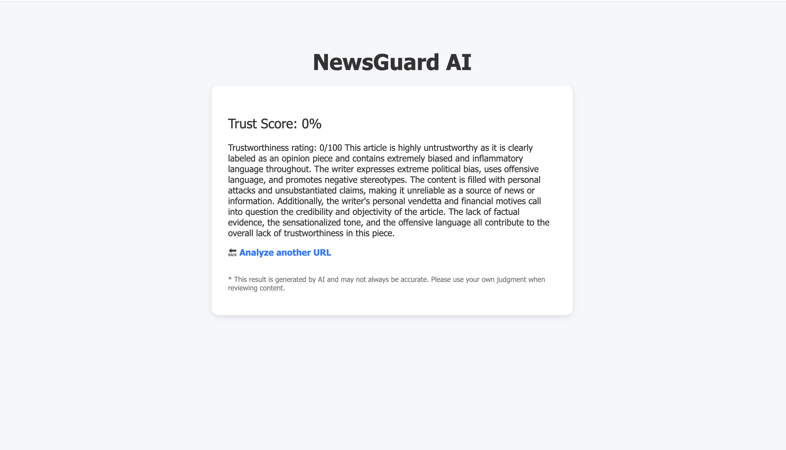
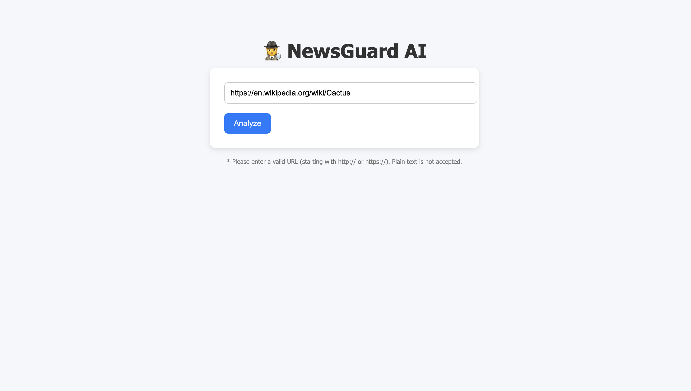
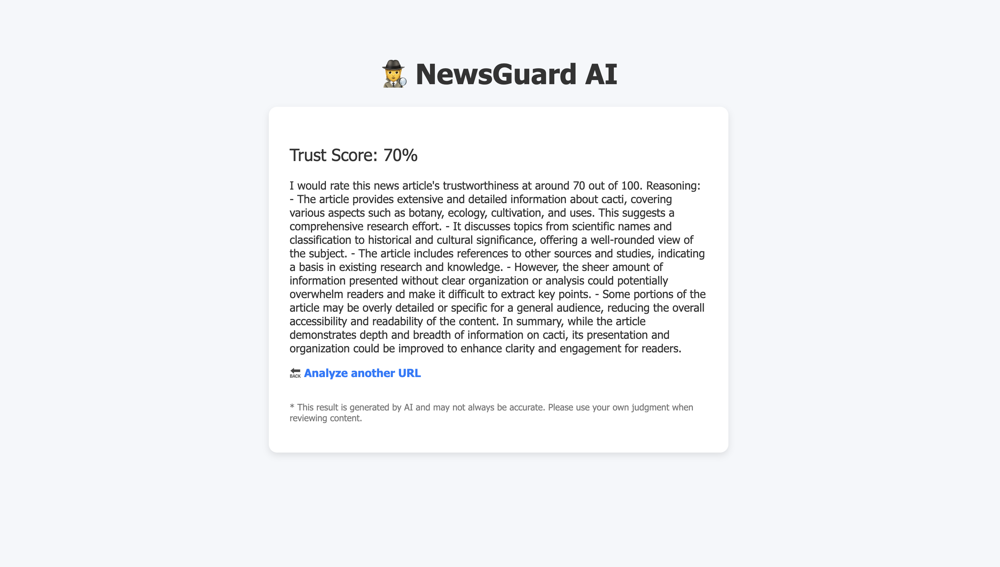

# 📰 NewsGuard AI

An AI-powered Flask web app that analyzes the **trustworthiness** of news articles using OpenAI's GPT-3.5-turbo. It summarizes the article and provides a credibility score with an explanation.

The screenshots below show the results of giving links of fake news and wikipedia page.

---

## 🔍 Features

- ✅ Input a **URL** or paste a **text** directly
- 🧠 **Summarizes** the content using GPT
- 📊 Provides a **trustworthiness score** (0–100)
- 💬 Explains the reasoning behind the score
- 🌐 Built with Python, Flask, BeautifulSoup, and OpenAI API

---

## 🚀 Demo

Try it locally with:

git clone https://github.com/your-username/newsguard-ai.git
cd newsguard-ai
python3 -m venv venv
source venv/bin/activate
pip install -r requirements.txt

Then create a .env file with your OpenAI key:
OPENAI_API_KEY=sk-xxxxxxxxxxxxxxxxxxxxx

Run the app:
flask run

Go to http://127.0.0.1:5000 in your browser.

🛠 Technologies
Python 3.10+

Flask

OpenAI GPT-3.5 API

BeautifulSoup

HTML/CSS

